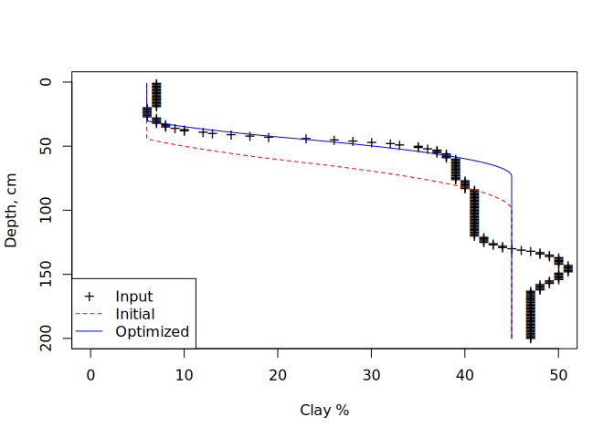

<!-- README.md is generated from README.Rmd. Please edit that file -->

# {soilmotif}

<!-- badges: start -->
<!-- badges: end -->

The goal of {soilmotif} is to provide an easy way to fit generalized
shape functions to soil property data that vary over depth. The
parameters of shape functions are designed to provide simple terminology
and intuitive descriptors for comparing the depth distributions of
properties found in soils of different areas and as predicted by
different types of models.

## Installation

You can install the development version of {soilmotif} like so:

``` r
remotes::install_github("brownag/soilmotif")
```

## Example

This is a basic example which shows you how to fit a sigmoidal depth
distribution model to a step and spline representations of some soil
property data as a function of depth.

The sample data comes from the {aqp} `jacobs2000` dataset. We are using
just select horizon data from the first profile in that
`SoilProfileCollection` object.

``` r
library(soilmotif)

# from aqp::jacobs2000, profile 1
x <- data.frame(
  id = "jacobs2000_1",
  top = c(0, 18, 43, 79, 130, 153, 156),
  bottom = c(18, 43, 79, 130, 153, 156, 200),
  clay = c(7, 6, 39, 41, 51, 50, 47),
  depletion_pct = c(0, 0, 0, 0, 2, 0, 15)
)
```

# Step-wise Horizon-level Depletion Percentage Example

Common morphologic descriptions of soils by genetic horizon can be made
continuous by assuming they represent a “step” function. Repeat the
horizon-level property value as many times as each horizon is thick (in
centimeters, or whatever unit you are interested in).

Here, we convert the percentage of the matrix occupied by depletions
`depletion_pct` into a continuous step-function representation, then
attempt to fit a sigmoid model to the distribution using `sm_motif()`.
After inspection, we use `sm_optim()` to optimize a model based on our
first guess (that the depletions appear around 40 cm and peak by 60 cm).

``` r
depl_step <- rep(x$depletion_pct, x$bottom - x$top)

plot(rep(c(0, 20), 100), 1:200, ylim = c(200, 0), type = "n")
points(depl_step, 1:200, pch = "+")

# visualize what the "first guess" looks like
lines(sm_motif(depl_step, c(40, 60)), 1:200, col = "red", lty = 2)

# find an optimized model
m <- sm_optim(depl_step, c(40, 60))
lines(m, 1:200, col = "blue")
attr(m, "par")
#> [1] 156.6496 156.7814

legend("topright", c("Input", "Initial", "Optimized"),
       pch = c("+", NA, NA),
       lty = c(NA, 2, 1),
       col = c("BLACK","RED","BLUE"))
```


We find that the blue line (the optimized model) captures the
transition, and best-fit parameters indicate a rapid increase at 156 cm
depth, mirroring the increase from the input data.

# Continuous Spline Clay Content Example

The results can be more interesting when the depth function is more
complicated. The simplified shapes can be used to group and generalize
patterns, while ideally capturing the same types of major transitions
across depth.

The following is a mass-preserving spline created using {mpspline2},
with values rounded to integers for compression into `"rle"` object for
minimal example:

``` r
clay_spline <- inverse.rle(structure(list(
  lengths = c(19, 8, 5, 3, 1, 2, 1, 1, 1, 1, 1, 1, 1, 1, 1, 1, 1, 2, 1, 3, 4, 
              17, 7, 37, 5, 2, 2, 1, 1, 1, 2, 2, 6, 6, 6, 3, 5, 38),
  values = c(7, 6, 7, 8, 9, 10, 12, 13, 15, 17, 19, 23, 26, 28, 30, 32, 33, 35,
             36, 37, 38, 39, 40, 41, 42, 43, 44, 45, 46, 47, 48, 49, 50, 51, 50,
             49, 48, 47)), class = "rle"
))

plot(rep(c(0, 50), 100), 1:200, ylim = c(200, 0), type = "n")
points(clay_spline, 1:200, pch = "+")
lines(sm_motif(clay_spline, c(40, 60)), 1:200, col = "red", lty = 2)
lines(sm_optim(clay_spline, c(40, 60)), 1:200, col = "blue")
legend("bottomleft", c("Input", "Initial", "Optimized"),
       pch = c("+", NA, NA),
       lty = c(NA, 2, 1),
       col = c("BLACK","RED","BLUE"))
```


